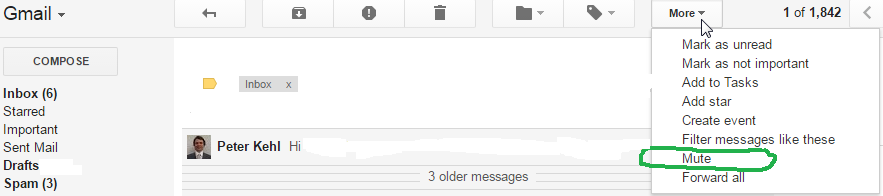

##Who benefits?##
People who
 * search with labels or stars, or
 * receive many replies, or send emails in batches (invitations, announcements, followups, Christmas/ New Year/ Chinese New Year/ Passover/ Easter/ Eid Al-Fitr...)

##Functionality##

###Search with stars and labels
Imagine you add a label to a message, or you star it. Someone replies to it later. Any later replies won't have that label and star assigned, even though they show up in the same thread. (Those later messages don't get found when you search under that label or star.) This add-on helps you find such messages.

###"Power Mute"
Do you use "Mute" command in GMail?

That mutes replies, but it excludes any replies sent direct to you. (See [Mute](http://smallbusiness.chron.com/mute-mean-gmail-62428.html) for standard GMail limitations.)

This add-on allows you to mute any responses, including direct ones. (Like classic "Mute", they will be left unread and archived.)

If you send emails in batches, you can choose "Fully Mute" mode. Once you activate it, any threads that you start or respond to will be fully muted. That applies until you deactivate "Fully Mute".

##Focus##
This community primarily improves GMail for end users. Solutions work preferrably with any GMail client (web, IMAP or mobile). We may also extend Google Drive (Docs, Sheets), by adding new commands to the menus. Other technologies: Contacts, Forms, Calendar, Groups, Maps.

Implementation is by [Google Apps Scripts](https://www.google.com/script/start/). Not by Google Apps or custom hosted applications. Apps Scripts are easy to share, to update (as libraries) and to replicate (no need for hosting).
